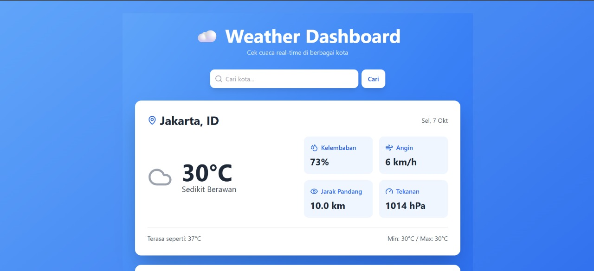

# Weather Dashboard 🌤️☀️🌧️❄️

A real-time weather dashboard built with **React** 💻 and **OpenWeatherMap API** 🌐.  
Check current weather and 5-day forecasts for any city, all in a **responsive and modern UI** ⚡.

---

## Demo 🎬

  

---

## Features ✨

- 🔍 Search for any city and get current weather information.
- 📅 View 5-day weather forecast.
- 🌈 Dynamic weather icons using **lucide-react**.
- 📱 Responsive design with **Tailwind CSS**.
- ⚠️ Handles errors and loading states gracefully.

---

## Technologies Used 🛠️

- **React.js** – Frontend framework
- **Tailwind CSS** – Styling and responsive UI 
- **Lucide-react** – Weather icons 
- **OpenWeatherMap API** – Weather data 
- **JavaScript (ES6)** – App logic 

---

## Installation 🚀

1. Clone this repository:
git clone https://github.com/your-username/weather-dashboard.git

2. Navigate to the project folder:
cd weather-dashboard

3. Install dependencies:
npm install

4. Create a .env file (optional) to store your OpenWeatherMap API key:
REACT_APP_API_KEY=your_api_key_here

5. Start the development server:
npm start

## Usage 🎯

1. Type the name of a city in the search bar.
2. Press Enter or click the Search button.
3. View current weather and 5-day forecast.
4. Icons and colors dynamically reflect the weather conditions.

## License 📄
This project is open-source and free to use 👐.
